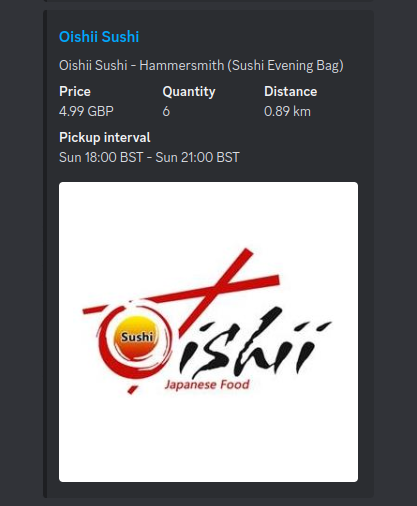

# TooGoodToGo Discord Bot 🥪 

This discord bot helps you keep track what TGTG magic bags available in a given area. 

When the bot is set, it posts available bags to a discord channel. It's capable to update and delete them when the quantity changes.

## Requirements

Use the release binaries or check the compile section at the bottom. 

You will need a Discord API Token and TGTG credentials. 
- For Discord, you can go [here](https://discord.com/developers/applications) and create a bot retrieve its token.
- For TGTG, the system uses unofficial TGTG api from [here](https://github.com/ahivert/tgtg-python). Check retrieve tokens section and retrieve your access token, refresh token, user id and cookie.

Once you have the necessary token, put them into your environment variables (or .env file). 

The system also uses an sqlite db system for the bot to remember channels and locations from previous runs. 

You can generate an empty sqlite db as follows:

```
sqlite3 bot.db < migrations/20220301134633_bot.sql 
```

You should also set the db environment variable (DATABASE_URL) as well.

Example ```.env``` file for environment variables:
```
TGTG_ACCESS_TOKEN=XXX
TGTG_REFRESH_TOKEN=XXX
TGTG_USER_ID=XXX
TGTG_COOKIE=XXX
DISCORD_TOKEN=XXX
DATABASE_URL=sqlite:bot.db
RUST_LOG=info
```

Install python dependencies to your python environment with:

```
pip install -r requirements.txt
```

## Bot permissions

Invite your created bot to your discord server with the following permissions.

### Scopes:
```
bot
applications.commands
```

### Bot permissions:
```
Send messages
Manage messages
Embed links
```

### Privileged Gateway Intents

```
Message Content Intent
```

## Bot Usage

Available commands can be seen with the `/` usage.


You should register the location as the first command to be able use the bot. You can retrieve the wanted location's latitude and longitude on OpenStreetMaps' address bar or on Google Maps' context menu. Setting a radius is optional. It defaults to 3 km. 

### Example - Setting a location


The bot responds with a message to confirm.


### Example - Starting


The bot acknowledges the command with a reply. This applies to stop as well.

### Example - Status


The bot responds with the confirmation of the location and its monitoring status.

### Example - Listing



The listing includes price, quantity, distance and the pickup interval time. If you click the listing, you will be redirected to OSM for the store location. The bot automatically updates if the quantity changes or deletes it if the item is not available anymore.

## Compilation

The system uses sqlx for compile time query verification. Therefore, the database file needs to be present and loaded into the environment variable at compile time.

```
export DATABASE_URL=sqlite:bot.db
sqlite3 bot.db < migrations/20220301134633_bot.sql 
pip install -r requirements.txt
cargo b --release
```

### Cross-compiling for arm

You can use the supplied cross-compilation docker images `Dockerfile.arm64` and `Dockerfile.armhf` to build and extract binaries.

Example for arm64:

```bash
docker build --target builder -t tgtg_arm64 -f Dockerfile.arm64 .
docker create --name dummy_tgtg_arm64 localhost/tgtg_arm64:latest
docker cp dummy_tgtg_arm64:"/app/bin/*" .
```

## Docker

You can use the docker image for amd64.

```bash
docker pull gokberkkocak/tgtg-discord-bot
```

Alternatively, github packages image is also available.

Afterwards you can run the container while supplying necessary env variables like below.

```bash
docker run -d --env-file .env gokberkkocak/tgtg-discord-bot:latest 
```

## Systemctl service

You can use the provided ```systemd``` service file to run the bot as a service. 

```
[Unit]
Description=TGTG discord bot service
After=network.target

[Service]
Type=simple
Restart=always
WorkingDirectory=/your/path/tgtg/
Environment=PATH=/your/venv/path/bin
Environment=RUST_LOG=warn
ExecStart=/your/path/tgtg/tgtg-discord-bot
Restart=on-failure

[Install]
WantedBy=multi-user.target
```

Change the working directory, virtual environment path and the executable path accordingly.

You can change the RUST_LOG environment variable to ```info``` to store more detailed logs including tgtg bag listings.

## Why Rust-Python Bridge

While the unofficial tgtg API is only available on Python, there are plenty of discord API targetting libraries in various languages. The main reason this project uses Rust on top of tgtg python api is that I wanted to try out ```pyo3``` framework which bridges python land with rust. I found the framework very flexible. The second reason is to try a discord library in rust language. For this purpose, ```serenity``` / ```poise``` discord api wrappers on rust ecosystem seems very powerful and makes it easy to plan around memory-safe concurrent data usage with tokio async runtime. 
